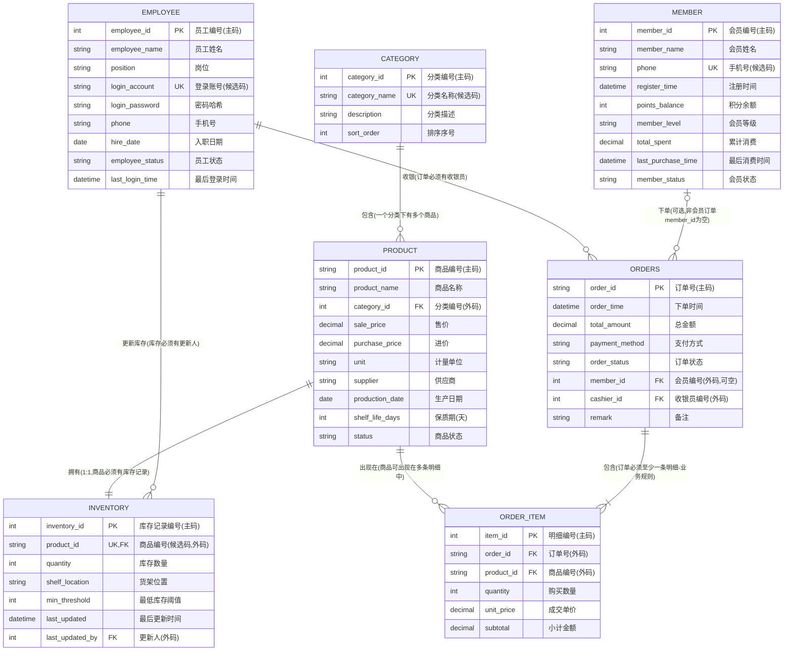

# 第六周 ER 图（v1.0，规范化重构后）

> 本文档为 ER 图的可编辑源文件，使用 Mermaid erDiagram 语法。
> 基于第五周 ER 图更新：新增 CATEGORY 实体，PRODUCT 的 category 字符串字段改为 category_id 外码。

## 符号图例

| 符号 | 含义 | 说明 |
|---|---|---|
| `||` | 恰好一个（必须参与） | 该端实体必须参与联系，且数量为1 |
| `o\|` | 零个或一个（可选参与） | 该端实体可以不参与联系，最多1个 |
| `o{` | 零个或多个（可选参与） | 该端实体可以不参与联系，数量为0或多 |
| `|{` | 一个或多个（必须参与） | 该端实体必须参与联系，至少1个 |

## ER 图



## v0.1 → v1.0 变更说明

### 新增实体

| 实体 | 主码 | 候选码 | 业务含义 | 新增理由 |
|---|---|---|---|---|
| CATEGORY（商品分类） | category_id | category_name | 商品的分类字典 | 消除 product.category 字符串的更新异常，支持分类描述、排序等扩展属性 |

### 修改实体

| 实体 | 变更内容 | 变更前 | 变更后 |
|---|---|---|---|
| PRODUCT | category 字段重构 | category VARCHAR(20)（字符串） | category_id INT（外码引用 CATEGORY） |

### 新增联系

| 联系 | 实体A | 实体B | 基数 | 实现方式 |
|---|---|---|---|---|
| 包含分类 | CATEGORY | PRODUCT | 1:N | product.category_id 外码，NOT NULL |

### 不变实体

MEMBER、EMPLOYEE、INVENTORY、ORDERS、ORDER_ITEM 结构不变，均已满足 3NF。

## 实体与联系说明

### 实体（7个）

| 实体 | 主码 | 候选码 | 业务含义 | 一行数据代表 |
|---|---|---|---|---|
| CATEGORY（分类） | category_id | category_name | 商品分类字典 | 一个商品分类 |
| MEMBER（会员） | member_id | phone | 注册会员顾客 | 一个注册会员的账户信息 |
| EMPLOYEE（员工） | employee_id | login_account | 店铺工作人员 | 一名员工的账户和基本信息 |
| PRODUCT（商品） | product_id | 无 | 小卖部售卖的商品 | 一个可售卖的商品SKU |
| INVENTORY（库存） | inventory_id | product_id | 商品的库存信息 | 一个商品的当前库存状态 |
| ORDERS（订单） | order_id | 无 | 顾客的交易订单 | 一笔完成的交易记录 |
| ORDER_ITEM（订单明细） | item_id | (order_id, product_id) | 订单中每个商品的明细 | 一个订单中某商品的购买记录 |

### 联系（7个）

| 联系 | 实体A | 实体B | 基数 | A端参与 | B端参与 | 实现方式 |
|---|---|---|---|---|---|---|
| 包含分类 | CATEGORY | PRODUCT | 1:N | 必须 | 必须 | product.category_id 外码，NOT NULL |
| 下单 | MEMBER | ORDERS | 1:N | 可选 | 可选 | orders.member_id 外码，可空 |
| 收银 | EMPLOYEE | ORDERS | 1:N | 必须 | 可选 | orders.cashier_id 外码，NOT NULL |
| 更新库存 | EMPLOYEE | INVENTORY | 1:N | 必须 | 可选 | inventory.last_updated_by 外码，NOT NULL |
| 拥有库存 | PRODUCT | INVENTORY | 1:1 | 必须 | 必须 | inventory.product_id 外码 + UNIQUE |
| 包含明细 | ORDERS | ORDER_ITEM | 1:N | 必须 | 必须 | order_item.order_id 外码，NOT NULL |
| 商品出现在明细 | PRODUCT | ORDER_ITEM | 1:N | 必须 | 可选 | order_item.product_id 外码，NOT NULL |

## 规范化重构分析

### 为什么拆分 CATEGORY

1. **消除更新异常**：原 product.category 为字符串，修改分类名需更新所有该分类商品行。
2. **消除数据不一致**：避免"饮料"和"饮品"拼写差异并存。
3. **支持扩展**：分类可添加描述、排序、图标等属性。
4. **满足 3NF**：若分类有独立属性，则原设计存在传递依赖 product_id → category → category_description。

### 无损连接验证

PRODUCT 与 CATEGORY 通过 category_id 连接：
```sql
SELECT p.product_id, p.product_name, c.category_name
FROM product p JOIN category c ON p.category_id = c.category_id;
```
可完全还原原 product.category 信息，满足无损连接。✓

### 依赖保持验证

- 原依赖 product_id → category 保持（product_id → category_id，category_id → category_name）
- 新增依赖 category_id → category_name, description, sort_order 在 CATEGORY 表中保持
✓
